# HOL 2: deploying a hybrid infrastructure for researchers in AWS


## GUILLERMO RIVO VÁZQUEZ

In this report, I go over the development and deployment of a hybrid infrastructure with AWS, aimed at providing data scientists access to online resources in the form of jupyter notebooks. This project focuses on establishing a secure, private Jupyter Notebook server for collaborative research, accessible via VPN, and a public-facing Voila server on Nginx would allow public access to specific notebooks. 


# AWS Resources Configuration

The project consists of a VPC, in which there will be 3 EC2 instances, one to enable VPN access, one to run the jupyter notebook server and one to run Nginx. All are accessible through the vpn but only the one running Nginx will be publicly accessible. There is also an S3 bucket where notebooks will be stored. Additional configuration steps covered later on in this report will allow the notebooks of this S3 bucket to be synchronized with those inside the EC2 instance running the Jupyter server.


## VPC

The VPC will need to have a name and a designated CIDR, in this case, we select 10.0.0.0/16:


<table>
  <tr>
   <td>


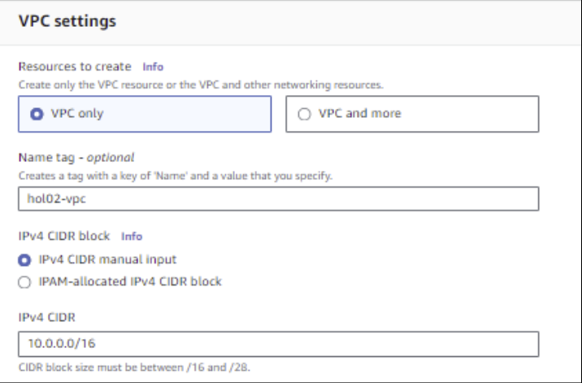

   </td>
   <td>

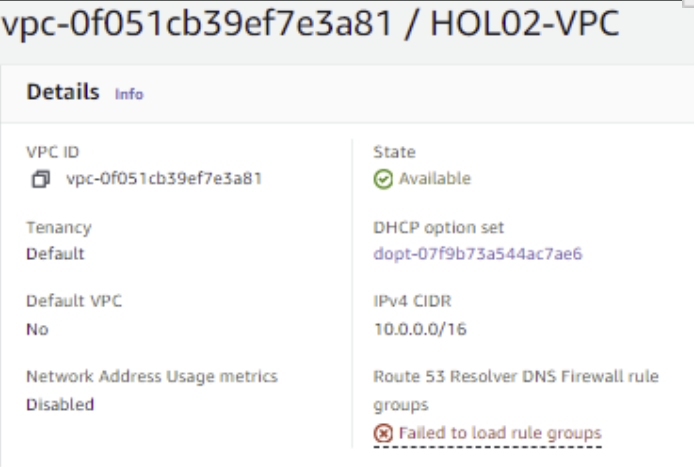

   </td>
  </tr>
</table>


## Subnets

Let’s now create 3 subnets, one for each of the EC2 instances needed. This is necessary because each will allow different types of connections, and thus we need a route table for each. The important aspects to keep in mind for the creation of each subnet is to place it inside the previously created VPC, the block of IPs that will belong to it and give it a descriptive name.


<p id="gdcalert3" ><span style="color: red; font-weight: bold">>>>>>  gd2md-html alert: inline image link here (to images/image3.png). Store image on your image server and adjust path/filename/extension if necessary. </span><br>(<a href="#">Back to top</a>)(<a href="#gdcalert4">Next alert</a>)<br><span style="color: red; font-weight: bold">>>>>> </span></p>


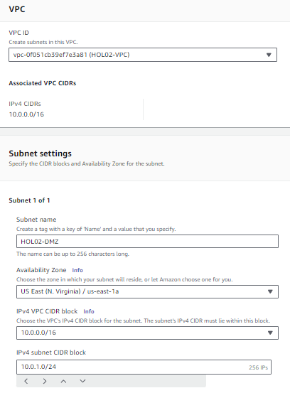


The subnets created should look like this:


<p id="gdcalert4" ><span style="color: red; font-weight: bold">>>>>>  gd2md-html alert: inline image link here (to images/image4.png). Store image on your image server and adjust path/filename/extension if necessary. </span><br>(<a href="#">Back to top</a>)(<a href="#gdcalert5">Next alert</a>)<br><span style="color: red; font-weight: bold">>>>>> </span></p>


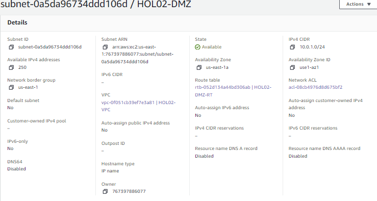


<p id="gdcalert5" ><span style="color: red; font-weight: bold">>>>>>  gd2md-html alert: inline image link here (to images/image5.png). Store image on your image server and adjust path/filename/extension if necessary. </span><br>(<a href="#">Back to top</a>)(<a href="#gdcalert6">Next alert</a>)<br><span style="color: red; font-weight: bold">>>>>> </span></p>


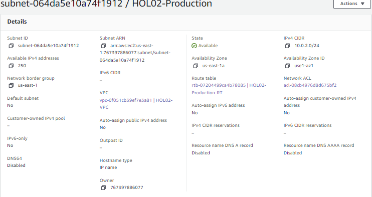


<p id="gdcalert6" ><span style="color: red; font-weight: bold">>>>>>  gd2md-html alert: inline image link here (to images/image6.png). Store image on your image server and adjust path/filename/extension if necessary. </span><br>(<a href="#">Back to top</a>)(<a href="#gdcalert7">Next alert</a>)<br><span style="color: red; font-weight: bold">>>>>> </span></p>


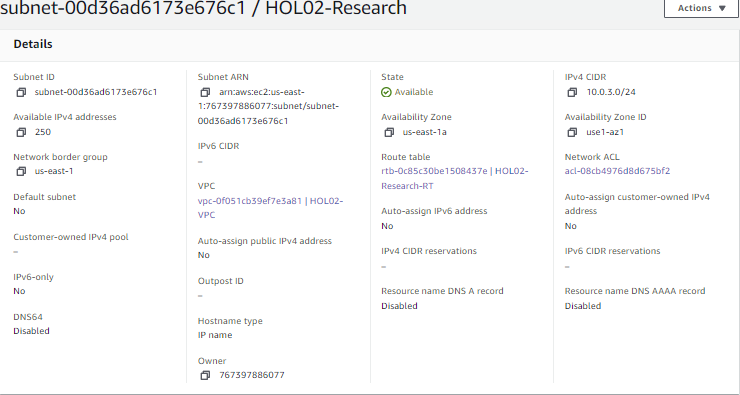


## Internet Gateway

We need to create an internet gateway and associate it to the VPC. This is a networking component that will allow resources inside the VPC to send and receive traffic from the public internet. We need to create one with an appropriate name and then attach it to the previously created VPC. The result should look like this:


<p id="gdcalert7" ><span style="color: red; font-weight: bold">>>>>>  gd2md-html alert: inline image link here (to images/image7.png). Store image on your image server and adjust path/filename/extension if necessary. </span><br>(<a href="#">Back to top</a>)(<a href="#gdcalert8">Next alert</a>)<br><span style="color: red; font-weight: bold">>>>>> </span></p>


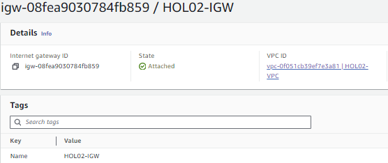


## Route tables

Route tables inside AWS are used to control the flow of network traffic inside a VPC. We need to create 3 route tables, one for each subnet inside the VPC, and then associate them to the corresponding subnets.

For all of the subnets, the corresponding route table must have the following routes:


* Destination: 0.0.0.0/0 - target: the internet gateway associated with the VPC. This allows traffic to and from the internet.
* Destination: 10.0.0.0/16 - target: local. This specifies that all traffic coming from the range of IPs denoted by 10.0.0.0/16 (so all traffic from inside the VPC) should be handled through the VPC.

The route table for the research subnet looks like this (the rest are exactly the same except for the table name and the subnet they are associated to):


<p id="gdcalert8" ><span style="color: red; font-weight: bold">>>>>>  gd2md-html alert: inline image link here (to images/image8.png). Store image on your image server and adjust path/filename/extension if necessary. </span><br>(<a href="#">Back to top</a>)(<a href="#gdcalert9">Next alert</a>)<br><span style="color: red; font-weight: bold">>>>>> </span></p>


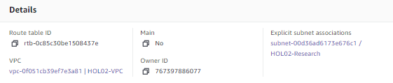


<p id="gdcalert9" ><span style="color: red; font-weight: bold">>>>>>  gd2md-html alert: inline image link here (to images/image9.png). Store image on your image server and adjust path/filename/extension if necessary. </span><br>(<a href="#">Back to top</a>)(<a href="#gdcalert10">Next alert</a>)<br><span style="color: red; font-weight: bold">>>>>> </span></p>


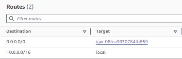


## Security Groups

Security groups are collections of rules that can be attached to EC2 instances to dictate what type of traffic is allowed for what port and from where. They define inbound rules for inbound traffic and outbound rules for outbound traffic. Through these security groups we are going to decide which EC2 instances will be accessible from the internet or through SSH while connected to the VPN. 

The following tables summarize the rules for each of the three security groups:


### HOL02-DMZ-SG Rules


<table>
  <tr>
   <td><strong>Rule Type</strong>
   </td>
   <td><strong>Type</strong>
   </td>
   <td><strong>Protocol</strong>
   </td>
   <td><strong>Port Range</strong>
   </td>
   <td><strong>Source/Destination</strong>
   </td>
  </tr>
  <tr>
   <td>Inbound
   </td>
   <td>Custom TCP
   </td>
   <td>TCP
   </td>
   <td>Custom
   </td>
   <td>sg-00b79cae8b54d5da
   </td>
  </tr>
  <tr>
   <td>Inbound
   </td>
   <td>HTTPS
   </td>
   <td>TCP
   </td>
   <td>443
   </td>
   <td>0.0.0.0/0
   </td>
  </tr>
  <tr>
   <td>Inbound
   </td>
   <td>Custom UDP
   </td>
   <td>UDP
   </td>
   <td>1194
   </td>
   <td>0.0.0.0/0
   </td>
  </tr>
  <tr>
   <td>Inbound
   </td>
   <td>Custom TCP
   </td>
   <td>TCP
   </td>
   <td>943
   </td>
   <td>0.0.0.0/0
   </td>
  </tr>
  <tr>
   <td>Inbound
   </td>
   <td>SSH
   </td>
   <td>TCP
   </td>
   <td>22
   </td>
   <td>0.0.0.0/0
   </td>
  </tr>
  <tr>
   <td>Outbound
   </td>
   <td>All traffic
   </td>
   <td>All
   </td>
   <td>All
   </td>
   <td>0.0.0.0/0
   </td>
  </tr>
</table>


The **inbound rules **allow traffic for SSH, HTTPS, and other specific TCP and UDP ports from any source, which is typical for a DMZ (Demilitarized Zone) that interacts with external traffic.

The **outbound rule **allows all traffic to leave the DMZ, which is standard to ensure that responses to inbound requests can reach their destination.


### HOL02-Research-SG Rules


<table>
  <tr>
   <td><strong>Rule Type</strong>
   </td>
   <td><strong>Type</strong>
   </td>
   <td><strong>Protocol</strong>
   </td>
   <td><strong>Port Range</strong>
   </td>
   <td><strong>Source/Destination</strong>
   </td>
  </tr>
  <tr>
   <td>Inbound
   </td>
   <td>Custom TCP
   </td>
   <td>TCP
   </td>
   <td>8888
   </td>
   <td>sg-02dee940ff9401894
   </td>
  </tr>
  <tr>
   <td>Inbound
   </td>
   <td>SSH
   </td>
   <td>TCP
   </td>
   <td>22
   </td>
   <td>sg-02dee940ff9401894
   </td>
  </tr>
  <tr>
   <td>Outbound
   </td>
   <td>Custom TCP
   </td>
   <td>TCP
   </td>
   <td>8888
   </td>
   <td>sg-02dee940ff9401894
   </td>
  </tr>
  <tr>
   <td>Outbound
   </td>
   <td>SSH
   </td>
   <td>TCP
   </td>
   <td>22
   </td>
   <td>sg-02dee940ff9401894
   </td>
  </tr>
  <tr>
   <td>Outbound
   </td>
   <td>HTTPS
   </td>
   <td>TCP
   </td>
   <td>443
   </td>
   <td>0.0.0.0/0
   </td>
  </tr>
</table>


**Inbound rules **restrict access to SSH and a custom TCP port for Jupyter Notebook, to traffic coming only from the DMZ security group.

**Outbound rules **allow the Research subnet to communicate back to the DMZ and to initiate HTTPS connections to the internet, this will allow synchronization with the S3 bucket.


### HOL02-Production-SG Rules


<table>
  <tr>
   <td><strong>Rule Type</strong>
   </td>
   <td><strong>Type</strong>
   </td>
   <td><strong>Protocol</strong>
   </td>
   <td><strong>Port Range</strong>
   </td>
   <td><strong>Source/Destination</strong>
   </td>
  </tr>
  <tr>
   <td>Inbound
   </td>
   <td>SSH
   </td>
   <td>TCP
   </td>
   <td>22
   </td>
   <td>sg-02dee940ff9401894
   </td>
  </tr>
  <tr>
   <td>Inbound
   </td>
   <td>HTTP
   </td>
   <td>TCP
   </td>
   <td>80
   </td>
   <td>0.0.0.0/0
   </td>
  </tr>
  <tr>
   <td>Inbound
   </td>
   <td>HTTPS
   </td>
   <td>TCP
   </td>
   <td>443
   </td>
   <td>0.0.0.0/0
   </td>
  </tr>
  <tr>
   <td>Outbound
   </td>
   <td>All traffic
   </td>
   <td>All
   </td>
   <td>All
   </td>
   <td>0.0.0.0/0
   </td>
  </tr>
</table>


The **inbound rules **for SSH connections from the DMZ are used to establish connections to the EC2 instance and manage various aspects about the server, while HTTP and HTTPS from any source is indicated for a server like this one serving web content.

The **outbound rule**, similar to the DMZ, allows all traffic to ensure the services can send responses to requests they receive.


## EC2 Instances

EC2 instances are virtual servers in Amazon's Elastic Compute Cloud (EC2) for running applications on the AWS infrastructure. They provide scalable computing capacity, letting users build applications and services. EC2 instances come in different sizes and configurations, making them easy to optimize to do specific jobs and be highly scalable. Users have more configuration settings apart from the size of the instance, they can also choose the required operating systems, networks, and security settings.

For this project, 3 instances have been created and configured in the following way:


### HOL02-VPN


<table>
  <tr>
   <td><strong>Setting</strong>
   </td>
   <td><strong>Value</strong>
   </td>
  </tr>
  <tr>
   <td>Name
   </td>
   <td>HOL02-VPN
   </td>
  </tr>
  <tr>
   <td>Subnet
   </td>
   <td>HOL02-DMZ
   </td>
  </tr>
  <tr>
   <td>AMI
   </td>
   <td>Ubuntu 22.04 LTS
   </td>
  </tr>
  <tr>
   <td>Security Group
   </td>
   <td>HOL02-DMZ-SG
   </td>
  </tr>
  <tr>
   <td>Elastic IP
   </td>
   <td>Yes
   </td>
  </tr>
</table>


<p id="gdcalert10" ><span style="color: red; font-weight: bold">>>>>>  gd2md-html alert: inline image link here (to images/image10.png). Store image on your image server and adjust path/filename/extension if necessary. </span><br>(<a href="#">Back to top</a>)(<a href="#gdcalert11">Next alert</a>)<br><span style="color: red; font-weight: bold">>>>>> </span></p>


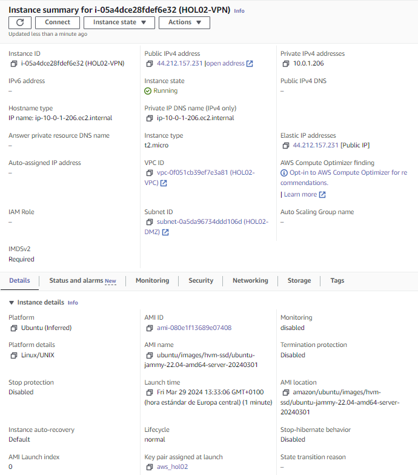


### HOL02-VoilaServer


<table>
  <tr>
   <td><strong>Setting</strong>
   </td>
   <td><strong>Value</strong>
   </td>
  </tr>
  <tr>
   <td>Name
   </td>
   <td>HOL02-VoilaServer
   </td>
  </tr>
  <tr>
   <td>Subnet
   </td>
   <td>HOL02-Production
   </td>
  </tr>
  <tr>
   <td>AMI
   </td>
   <td>Amazon Linux 2
   </td>
  </tr>
  <tr>
   <td>Security Group
   </td>
   <td>HOL02-Production-SG
   </td>
  </tr>
  <tr>
   <td>Elastic IP
   </td>
   <td>No
   </td>
  </tr>
</table>


<p id="gdcalert11" ><span style="color: red; font-weight: bold">>>>>>  gd2md-html alert: inline image link here (to images/image11.png). Store image on your image server and adjust path/filename/extension if necessary. </span><br>(<a href="#">Back to top</a>)(<a href="#gdcalert12">Next alert</a>)<br><span style="color: red; font-weight: bold">>>>>> </span></p>


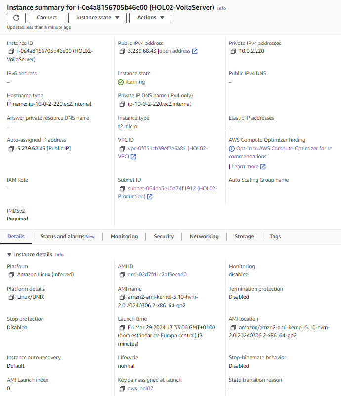


### HOL02-Jupyter


<table>
  <tr>
   <td><strong>Setting</strong>
   </td>
   <td><strong>Value</strong>
   </td>
  </tr>
  <tr>
   <td>Name
   </td>
   <td>HOL02-Jupyter
   </td>
  </tr>
  <tr>
   <td>Subnet
   </td>
   <td>HOL02-Research
   </td>
  </tr>
  <tr>
   <td>AMI
   </td>
   <td>Amazon Linux 2
   </td>
  </tr>
  <tr>
   <td>Security Group
   </td>
   <td>HOL02-Research-SG
   </td>
  </tr>
  <tr>
   <td>Elastic IP
   </td>
   <td>Not specified
   </td>
  </tr>
</table>


<p id="gdcalert12" ><span style="color: red; font-weight: bold">>>>>>  gd2md-html alert: inline image link here (to images/image12.png). Store image on your image server and adjust path/filename/extension if necessary. </span><br>(<a href="#">Back to top</a>)(<a href="#gdcalert13">Next alert</a>)<br><span style="color: red; font-weight: bold">>>>>> </span></p>


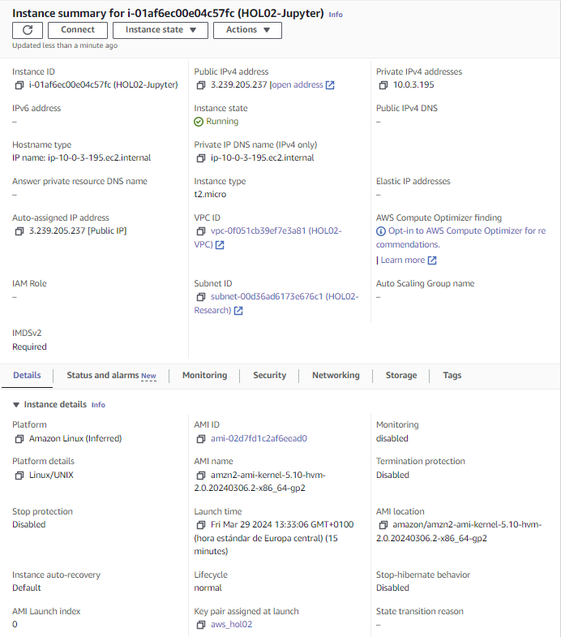


## S3 Bucket

The last AWS component needed is an S3 Bucket to upload Jupyter notebooks to. In our architecture, the files inside a notebook folder of HOL02-Jupyter EC2 instance will be synchronized with this S3 bucket. Keep in mind every bucket name must be unique across all existing buckets worldwide.


<table>
  <tr>
   <td>

<p id="gdcalert13" ><span style="color: red; font-weight: bold">>>>>>  gd2md-html alert: inline image link here (to images/image13.png). Store image on your image server and adjust path/filename/extension if necessary. </span><br>(<a href="#">Back to top</a>)(<a href="#gdcalert14">Next alert</a>)<br><span style="color: red; font-weight: bold">>>>>> </span></p>


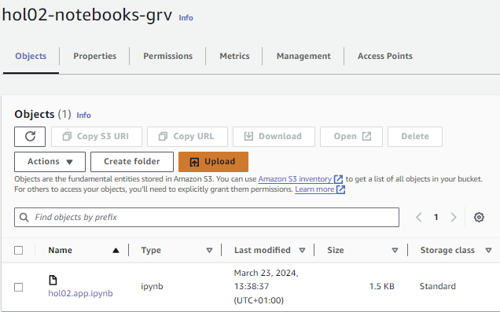

   </td>
   <td>

<p id="gdcalert14" ><span style="color: red; font-weight: bold">>>>>>  gd2md-html alert: inline image link here (to images/image14.png). Store image on your image server and adjust path/filename/extension if necessary. </span><br>(<a href="#">Back to top</a>)(<a href="#gdcalert15">Next alert</a>)<br><span style="color: red; font-weight: bold">>>>>> </span></p>


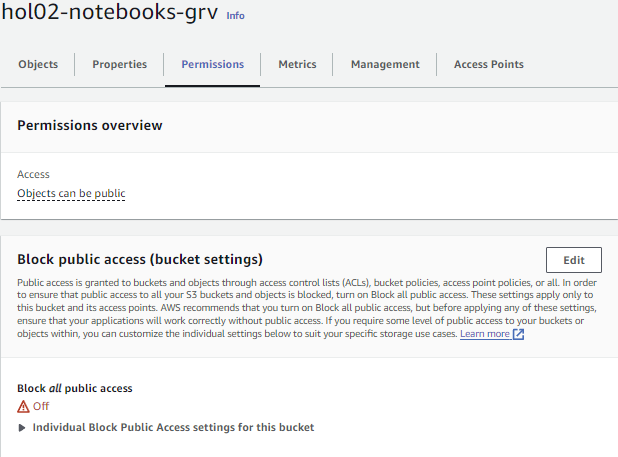

   </td>
  </tr>
</table>


## Additional configuration

Once we have all the AWS components that we need, it’s time to install and set up all the software needed in our EC2 machines. This includes installing and running Nginx, Jupyter, setting up the VPN and automating the synchronization with the S3 bucket. 


### VPN Setup


#### _OpenVPN Installation_

The initial step in configuring the VPN environment involves installing OpenVPN on the HOL02-VPN instance. We will do this by executing a series of commands after connecting through SSH. These commands will update the system packages, import the necessary GPG key for the OpenVPN repository, and install the OpenVPN Access Server.

**Update package lists:**

sudo apt update -y 

**Install GNU Privacy Guard:**

sudo apt install ca-certificates gnupg wget net-tools -y 

**OpenVPN download:**

sudo wget https://as-repository.openvpn.net/as-repo-public.asc -qO /etc/apt/trusted.gpg.d/as-repo-public.asc

**Add OpenVPN repo to APT package source list:**

sudo echo "deb [arch=amd64 signed-by=/etc/apt/trusted.gpg.d/as-repo-public.asc] http://as-repository.openvpn.net/as/debian jammy main" | sudo tee /etc/apt/sources.list.d/openvpn-as-repo.list 

**Update package database and install OpenVPN access server:**

sudo apt update && sudo apt install openvpn-as -y

Once this is done, we can access the admin login page through this address in our browser, “https://&lt;HOL02-VPN_instace_elastic_ip>:943/admin”, we should see something like this:


<p id="gdcalert15" ><span style="color: red; font-weight: bold">>>>>>  gd2md-html alert: inline image link here (to images/image15.png). Store image on your image server and adjust path/filename/extension if necessary. </span><br>(<a href="#">Back to top</a>)(<a href="#gdcalert16">Next alert</a>)<br><span style="color: red; font-weight: bold">>>>>> </span></p>


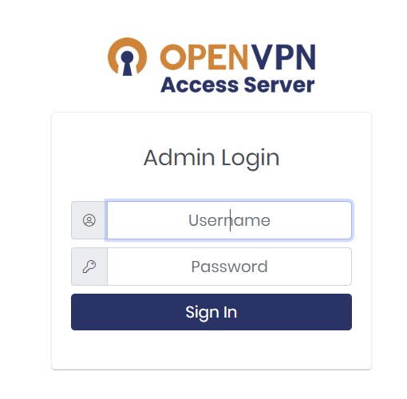


Keep in mind we can change the login details for the admin account (username openvpn) by running the following command inside the instance:_ sudo /usr/local/openvpn_as/scripts/sacli --user openvpn --new_pass &lt;desired_psswd> SetLocalPassword_


#### _OpenVPN Configuration_

Once the login is successful, you should see the admin interface:


<p id="gdcalert16" ><span style="color: red; font-weight: bold">>>>>>  gd2md-html alert: inline image link here (to images/image16.png). Store image on your image server and adjust path/filename/extension if necessary. </span><br>(<a href="#">Back to top</a>)(<a href="#gdcalert17">Next alert</a>)<br><span style="color: red; font-weight: bold">>>>>> </span></p>


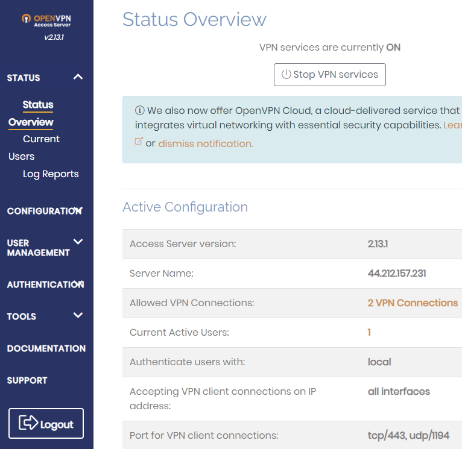


In the admin interface, we updated the network settings, assigning the hostname to the elastic IP:


<p id="gdcalert17" ><span style="color: red; font-weight: bold">>>>>>  gd2md-html alert: inline image link here (to images/image17.png). Store image on your image server and adjust path/filename/extension if necessary. </span><br>(<a href="#">Back to top</a>)(<a href="#gdcalert18">Next alert</a>)<br><span style="color: red; font-weight: bold">>>>>> </span></p>


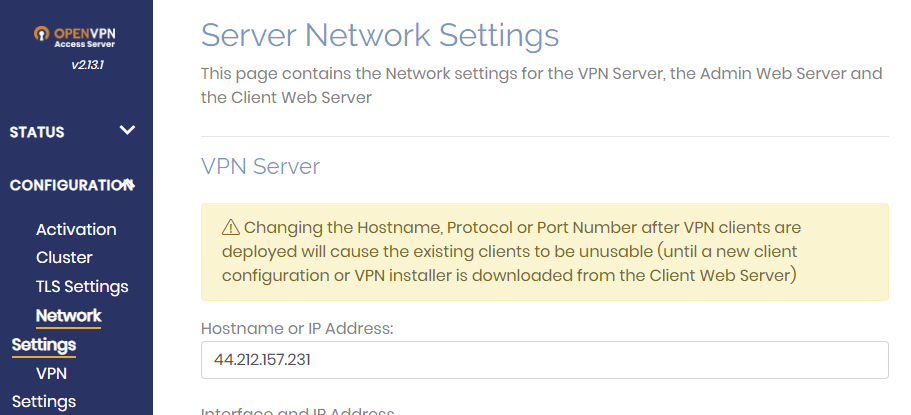


Subsequently, we modified the VPN settings to include the subnet CIDRs and adjusted the client traffic routing settings to disallow internet traffic through the VPN: 

<p id="gdcalert18" ><span style="color: red; font-weight: bold">>>>>>  gd2md-html alert: inline image link here (to images/image18.png). Store image on your image server and adjust path/filename/extension if necessary. </span><br>(<a href="#">Back to top</a>)(<a href="#gdcalert19">Next alert</a>)<br><span style="color: red; font-weight: bold">>>>>> </span></p>


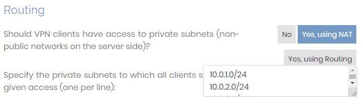


These changes were saved, and the interface was reloaded to apply the new configurations.


#### _OpenVPN Client Setup_

Following the server setup, we proceeded to install the OpenVPN client on our local machines. This was done by navigating to the admin interface of OpenVPN at the same elastic IP address and following the provided instructions to download and configure the user-locked profile:


<p id="gdcalert19" ><span style="color: red; font-weight: bold">>>>>>  gd2md-html alert: inline image link here (to images/image19.png). Store image on your image server and adjust path/filename/extension if necessary. </span><br>(<a href="#">Back to top</a>)(<a href="#gdcalert20">Next alert</a>)<br><span style="color: red; font-weight: bold">>>>>> </span></p>


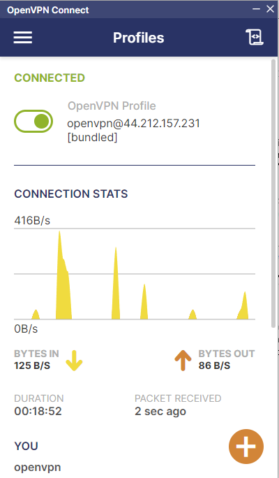


### Nginx Configuration

The EC2 instance called HOL02-VoilaServer will undergo a similar installation process for Nginx, a high-performance web server. We will connect to the previously created VPN. Depending on the operating system version, the installation commands are different for Amazon Linux 2023 and Amazon Linux 2:

**For Amazon Linux 2023**

_sudo dnf install nginx_

_sudo systemctl start nginx_

_sudo systemctl enable nginx_

**For Amazon Linux 2**

_sudo amazon-linux-extras install nginx1 -y_

_sudo systemctl start nginx_

_sudo systemctl enable nginx_

Once Nginx is installed, we start it and enable it to run on system boot, setting the stage for serving the Voila application, which is something we could do but is not in the scope of this project.

We can access the Nginx running start page by accessing this link “http://&lt;HOL02-VoilaServer_instace_public_ip>:80/”:

<p id="gdcalert20" ><span style="color: red; font-weight: bold">>>>>>  gd2md-html alert: inline image link here (to images/image20.png). Store image on your image server and adjust path/filename/extension if necessary. </span><br>(<a href="#">Back to top</a>)(<a href="#gdcalert21">Next alert</a>)<br><span style="color: red; font-weight: bold">>>>>> </span></p>


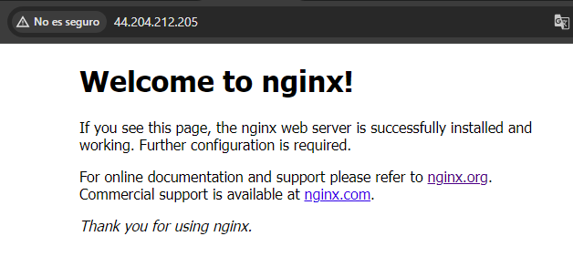


Alternatively, if we are connected through the vpn, we can also access this page using the instance private ip “http://&lt;HOL02-VoilaServer_instace_private_ip>:80/”:


<p id="gdcalert21" ><span style="color: red; font-weight: bold">>>>>>  gd2md-html alert: inline image link here (to images/image21.png). Store image on your image server and adjust path/filename/extension if necessary. </span><br>(<a href="#">Back to top</a>)(<a href="#gdcalert22">Next alert</a>)<br><span style="color: red; font-weight: bold">>>>>> </span></p>


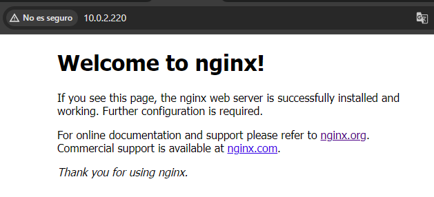


### Jupyter Notebook Setup

To run the Jupyter notebook server inside the designated instance, we first need to install python. For the installation of python inside HOL02-Jupyter we will connect to this instance through SSH and create a shell executable file with the bash instructions required for the installation and for the creation of a jupyter virtual environment. These are the contents of said file:


```
#!/bin/bash

PYTHON_VERSION=3.9.0
PYTHON_TAG=$(echo $PYTHON_VERSION | cut -d. -f1-2)

# Install necessary dependencies
sudo yum install -y gcc openssl11-devel bzip2-devel libffi-devel sqlite-devel

# Download and extract Python source
wget https://www.python.org/ftp/python/$PYTHON_VERSION/Python-$PYTHON_VERSION.tgz
tar -zxvf Python-$PYTHON_VERSION.tgz
cd Python-$PYTHON_VERSION

# Configure and install Python
sudo ./configure --enable-optimizations
sudo make altinstall

# Create symbolic link to the newly installed Python
if [ -f "/usr/local/bin/python${PYTHON_TAG}" ]; then
    sudo ln -sf "/usr/local/bin/python${PYTHON_TAG}" /usr/bin/python3
fi

# Upgrade awscli and pip
"/usr/local/bin/python${PYTHON_TAG}" -m pip install --upgrade awscli --user
"/usr/local/bin/python${PYTHON_TAG}" -m pip install --upgrade pip

# Clean up
cd ..
sudo rm -rf Python-$PYTHON_VERSION
sudo rm -rf Python-$PYTHON_VERSION.tgz

# Create a virtual environment
python3.9 -m venv jupyter-env
```


* We will save this file with the name “install-python39.sh” and run it with _bash install-python39.sh_ 
* We activate the virtual environment that we just created: _source jupyter-env/bin/activate_
* We upgrade pip:_ pip install --upgrade pip_
* We install the Jupyter package: _pip install jupyter_
* We create a directory to store the notebooks: _mkdir notebooks_
* We will now open the default text editor of our system to edit the crontab: _crontab -e_
* Once the editor is open, we will add this line to the crontab and then save it: _@reboot /bin/bash -c 'source /home/ec2-user/jupyter-env/bin/activate && nohup jupyter notebook --ip=0.0.0.0 --notebook-dir=/home/ec2-user/notebooks --no-browser > /home/ec2-user/notebooks/jupyter.log 2>&1 &'_
* The line we just added will activate the virtual environment created during previous steps whenever the EC2 instance is booted. It will also run the jupyter server, specifying an -ip parameter, a notebook directory and a logging file.

We can verify the jupyter server is running by connecting to the VPN and accessing this address in the browser “http://&lt;HOL02-Jupyter_instance_private_ip>:8888/”:


<p id="gdcalert22" ><span style="color: red; font-weight: bold">>>>>>  gd2md-html alert: inline image link here (to images/image22.png). Store image on your image server and adjust path/filename/extension if necessary. </span><br>(<a href="#">Back to top</a>)(<a href="#gdcalert23">Next alert</a>)<br><span style="color: red; font-weight: bold">>>>>> </span></p>


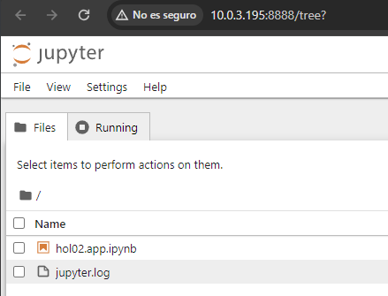


Also we can verify that it is impossible to connect to the Jupyter server from the public internet, which is the intended behavior for our application:


<p id="gdcalert23" ><span style="color: red; font-weight: bold">>>>>>  gd2md-html alert: inline image link here (to images/image23.png). Store image on your image server and adjust path/filename/extension if necessary. </span><br>(<a href="#">Back to top</a>)(<a href="#gdcalert24">Next alert</a>)<br><span style="color: red; font-weight: bold">>>>>> </span></p>


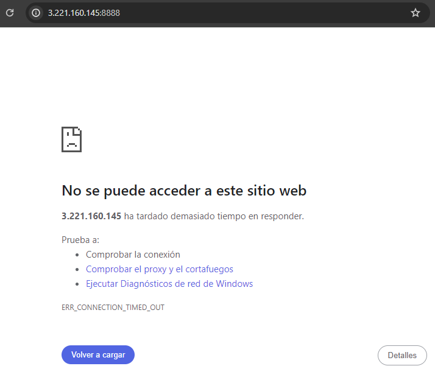


### Automated Synchronization with S3

This step involves using cron jobs again in order to periodically synchronize the contents of our notebook folder with the contents of the previously created S3 bucket. To do this we run _crontab -e _in order to open the crontab file with the systems default text editor and we add the following line:

_*/5 * * * * echo "$(date) - Sync started" >> /home/ec2-user/sync.log && aws s3 sync s3://&lt;the_name_of_your_s3_bucket> /home/ec2-user/notebooks/ >> /home/ec2-user/sync.log 2>&1 && echo "$(date) - Sync completed" >> /home/ec2-user/sync.log_

This will sync the files every 5 minutes and also update a log file with the progress. For example, by looking at my sync.log file I was made aware that my synchronizations suddenly stopped when my temporary session token expired:

_Sun Mar 24 13:15:01 UTC 2024 - Sync started_

_Sun Mar 24 13:15:02 UTC 2024 - Sync completed_

_Sun Mar 24 13:20:01 UTC 2024 - Sync started_

_Sun Mar 24 13:20:02 UTC 2024 - Sync completed_

_Thu Mar 28 19:40:01 UTC 2024 - Sync started_

_fatal error: An error occurred (ExpiredToken) when calling the ListObjectsV2 operation: The provided token has expired._
